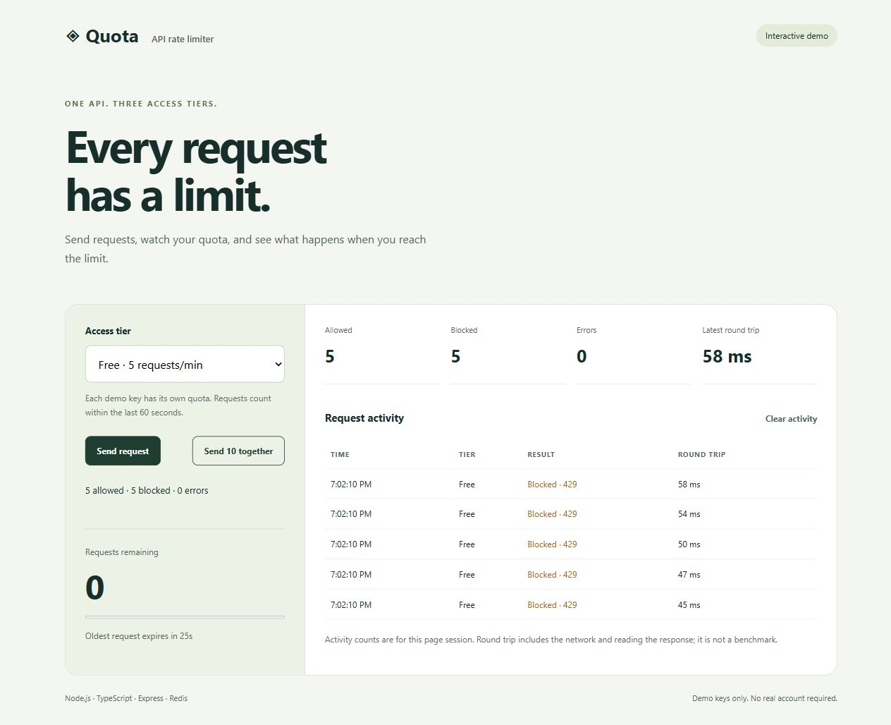

# Quota — Redis API Rate Limiter

A working demo of tier-based API limits with an interactive dashboard,
an atomic sliding-window check, integration tests, and reproducible benchmarks.

**Stack:** Node.js, TypeScript, Express, Redis, HTML/CSS/JavaScript, Docker.

## Try it

With Docker Desktop running:

~~~sh
docker compose up --build
~~~

Open **http://localhost:5000/demo/**. Pick a tier, send a request, then send
10 together. Watch the quota, allowed/blocked counts, reset countdown, and
request activity. A 429 means the limiter correctly rejected an excess request.

The dashboard shows measurements from your browser session, not benchmark results.
Clearing activity does not reset the server quota.

## Access tiers

| Tier | Requests in the last 60 seconds | Local demo key |
| --- | ---: | --- |
| Free | 5 | 12345-abcde |
| Pro | 20 | 67890-fghij |
| Admin | 100 | admin-key-000 |

Limits apply to each **API key + IP address** combination. Admin has a higher
quota; it does not bypass the limiter.

## How it works

~~~mermaid
flowchart LR
    A[Request + API key] --> B{Valid key?}
    B -->|No| C[401 Unauthorized]
    B -->|Yes| D[Redis Lua script]
    D --> E[Remove requests older than 60 seconds]
    E --> F{Quota available?}
    F -->|Yes| G[Record unique request ID]
    G --> H[200 + remaining quota]
    F -->|No| I[429 + Retry-After]
~~~

The entire Redis check runs atomically, so simultaneous requests cannot race
between reading the counter and recording an accepted request. Unique request
IDs prevent same-millisecond arrivals from overwriting each other. Rejected
requests do not consume quota or extend the window. Inactive counters expire.

Compared with the original implementation, each check uses **one Redis script
invocation instead of four separate Redis calls**. This is an implementation
count, not a measured speed improvement. A cold script cache may require a
reload before subsequent cached calls.

## API

~~~sh
curl -i http://localhost:5000/ -H "x-api-key: 12345-abcde"
~~~

A successful response includes:

~~~json
{
  "message": "Welcome! Your API key allows 5 requests per minute.",
  "remainingRequests": 4,
  "resetInSeconds": 60
}
~~~

- 200: allowed, with X-RateLimit-Limit and X-RateLimit-Remaining headers.
- 429: blocked, with Retry-After in seconds.
- 401: invalid or missing API key.
- 500: Redis check failed; the request is not passed through.
- GET /demo/: public dashboard, outside the request quota.
- GET /health: process health only; it does not verify Redis availability.

## Local development

~~~sh
npm ci
docker compose up -d redis
npm run dev
~~~

The backend uses REDIS_URL, defaulting to redis://localhost:6379.

~~~sh
npm run check
npm test
npm run build
~~~

Integration tests cover authentication, the 3 tier quotas, 100 simultaneous
Free requests, rolling-window expiry, inactive-key cleanup, API-key creation/revocation, shared quotas across two backend processes, and public demo
access. Tests clean only a unique per-run Redis namespace. GitHub Actions starts
Redis and runs checks, tests, and the build on pushes and pull requests.

## Measure performance

**API latency:**

~~~sh
npm run benchmark:http
~~~

This starts an isolated local HTTP server on a temporary port, uses a temporary
in-process benchmark key, warms up, then measures 10,000 requests with 50
concurrent workers. Timing includes authentication, the Redis check, and reading
the response body. The high benchmark quota is not a change to the demo tiers.

**Redis limiter calls only:**

~~~sh
npm run benchmark
~~~

This excludes HTTP and authentication. Do not describe its timings as API latency.

PowerShell settings:

~~~powershell
$env:BENCH_CONCURRENCY = "50"
$env:BENCH_REQUESTS = "10000"
$env:BENCH_MODE = "allowed"
$env:BENCH_OUTPUT = "docs/http-run-1.json"
npm run benchmark:http
~~~

Set BENCH_MODE to blocked to measure 429 responses separately. Run each workload
three times with the same settings. Report the median throughput and p95 across
those runs, alongside hardware, Node/Redis versions and concurrency. Keep errors
separate from intentional 429s. The benchmark cleans its own key.

Local HTTP tests recorded a median **2,592 requests/second** with **34.616 ms p95** at **50 concurrent workers** for allowed responses. These are demo-key, local-machine measurements, not production capacity.

See [raw results, environment and measurement notes](docs/BENCHMARKS.md).

## Project decisions and limitations

- Sliding windows expire individual requests; quotas do not reset on a fixed
  minute boundary.
- Redis is shared state, so separate backend instances can share a quota when
  they use the same key, IP identity and namespace. An integration test launches two independent Node processes and verifies they allow only 5 Free requests combined.
- Public demo keys can be disabled with ENABLE_DEMO_KEYS=false. Generated keys are stored as SHA-256 hashes; user accounts and billing are not included.
- Proxy trust is not enabled. A deployment behind a proxy needs an explicit,
  trusted IP policy before relying on per-IP limits.
- Each accepted request stores one entry. This design prioritizes exact
  counting at these quotas over constant-memory approximation.
- Docker Compose is for a local demo. No public deployment is included.

## Create and revoke API keys

Key management is disabled until ADMIN_TOKEN is configured. Keep that token
outside the frontend and use HTTPS for any remote deployment. The Admin tier
is a request quota; its API key does not grant key-management permissions.

PowerShell local setup (then restart the backend in the same terminal):

~~~powershell
$env:ADMIN_TOKEN = node -e "console.log(require('crypto').randomBytes(32).toString('hex'))"
$env:ENABLE_DEMO_KEYS = "false"
npm run dev
~~~

In a separate terminal with the same admin-token value:

~~~powershell
$headers = @{ "x-admin-token" = $env:ADMIN_TOKEN }
$created = Invoke-RestMethod -Method Post -Uri http://localhost:5000/admin/keys -Headers $headers -ContentType application/json -Body '{"name":"Demo client","tier":"free"}'
Invoke-RestMethod -Uri http://localhost:5000/ -Headers @{ "x-api-key" = $created.apiKey }
Invoke-RestMethod -Method Delete -Uri ("http://localhost:5000/admin/keys/" + $created.keyId) -Headers $headers
~~~

Creation returns the original key once. Redis stores its hash and tier metadata.
Revocation prevents subsequent authentication checks; an already authenticated
in-flight request may finish. Demo keys cannot be revoked through this API;
disable them when using generated credentials.

Docker Compose explicitly enables public demo keys and does not configure an
admin token. Generated keys live in Redis; this local setup has no persistent
Redis volume, so they are not durable across container replacement.
